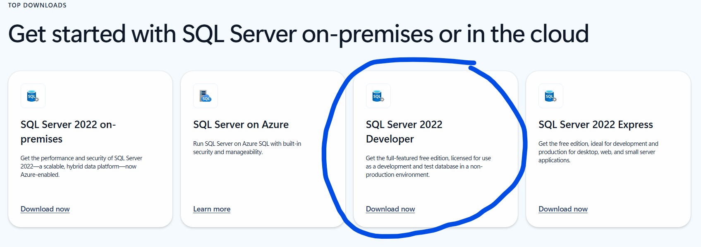
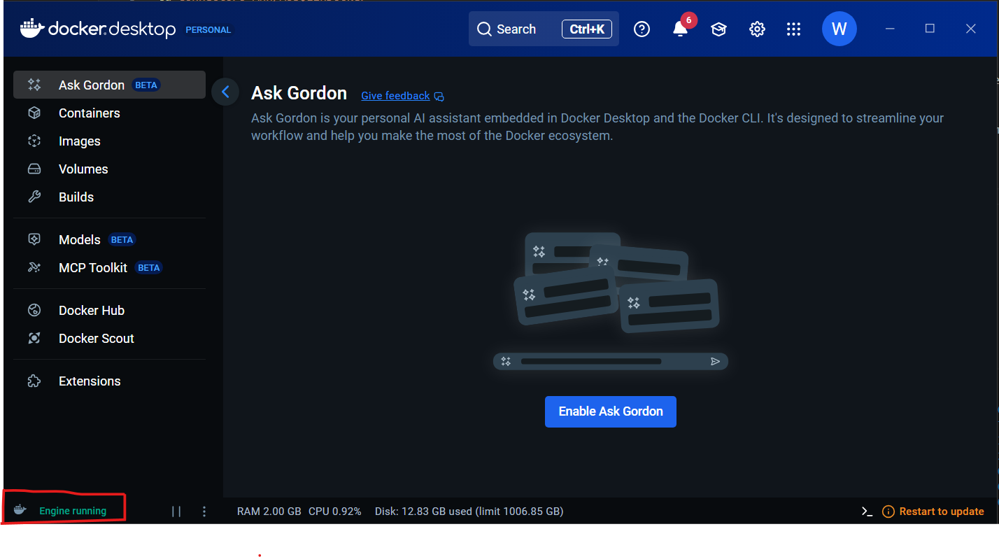
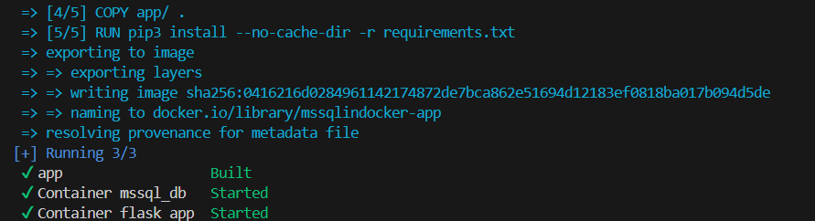

# MsSQL in Docker - Setup

This project provides a Docker deployed MsSQL connector that works locally.

## Step 1: Clone Repository
```bash
git clone https://github.com/smart-card-ai/Connectors-Ann/
cd Connectors-Ann/MsSQLinDocker
```

## Step 2: Install MsSQL and Docker

1. To install MsSQL go to [this link](https://www.microsoft.com/en-in/sql-server/sql-server-downloads) and download SQL Server 2022 Developer. 
(⚠︎ Not downloadable in Mac)

2. To install docker go to [this link](https://www.docker.com/products/docker-desktop/) and download according to your system.

## Step 3: Run docker

For this all you got to do is open Docker and ensure it's running.

Note: Remember to do this for using docker commands.

## Step 4: Run the Docker dB and App

To run use the below command
```bash
docker compose -f "docker-compose.yml" up -d --build
```
A successful building will look like this 

The App will now be available at `http://127.0.0.1:5000/` capable of accessing data from the local docker deployed mssql

## Step 5: Test with Postman
- Open Postman.
- Import the collection from /postman_export.
- Try out the requests in it.
